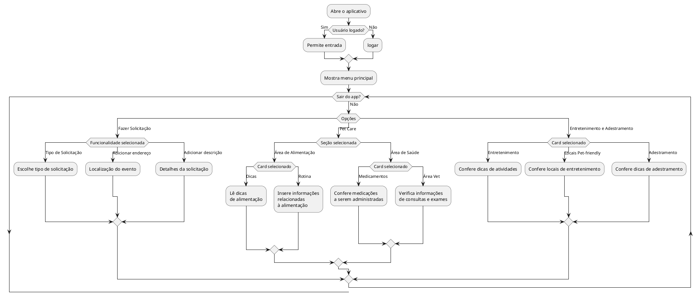

```plantuml
@startuml

:Abre o aplicativo;

if (Usuário logado?) then (Sim)
    :Permite entrada;
else (Não)
    :logar;
endif
:Mostra menu principal;

while (Sair do app?) is (Não)

switch (Opções)
case ( Fazer Solicitação )
    switch (Funcionalidade selecionada)
    case (Tipo de Solicitação)
        :Escolhe tipo de solicitação;
    case (Adicionar endereço)
        :Localização do evento;
    case (Adicionar descrição)
        :Detalhes da solicitação;
    endswitch
case ( Pet Care ) 
    switch (Seção selecionada)
    case (Área de Alimentação)
        switch (Card selecionado)
        case (Dicas)
            :Lê dicas\nde alimentação;
        case (Rotina)
            :Insere informações\nrelacionadas\nà alimentação;
        endswitch
    case (Área de Saúde)
        switch (Card selecionado)
        case (Medicamentos)
            :Confere medicações\na serem administradas;
        case (Área Vet)
            :Verifica informações\nde consultas e exames;
        endswitch
    endswitch
case ( Entretenimento e Adestramento )
    switch (Card selecionado)
    case (Entretenimento)
        :Confere dicas de atividades;
    case (Locais Pet-friendly)
        :Confere locais de entretenimento;
    case (Adestramento)
        :Confere dicas de adestramento;
    endswitch
endswitch


    

@enduml
```
