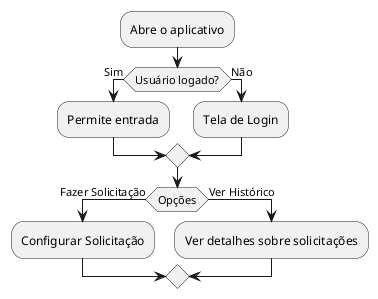

```plantuml
@startuml

:Abre o aplicativo;

if (Usuário logado?) then (Sim)
    :Permite entrada;
else (Não)
    :Tela de Login;
endif
    if (Opções) then (Fazer Solicitação)
        :Configurar Solicitação;
    else (Ver Histórico)
        :Ver detalhes sobre solicitações;
@enduml
@startuml
:Adm;
@enduml
```
