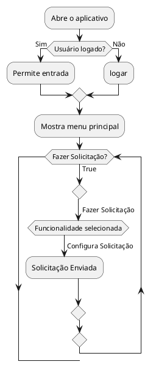

```plantuml
@startuml

:Abre o aplicativo;

if (Usuário logado?) then (Sim)
    :Permite entrada;
else (Não)
    :logar;
endif
:Mostra menu principal;

while (Fazer Solicitação?) is (True)
switch()
case ( Fazer Solicitação )
    switch (Funcionalidade selecionada)
    case (Configura Solicitação)
        :Solicitação Enviada;
    endswitch
endswitch


@enduml
```
