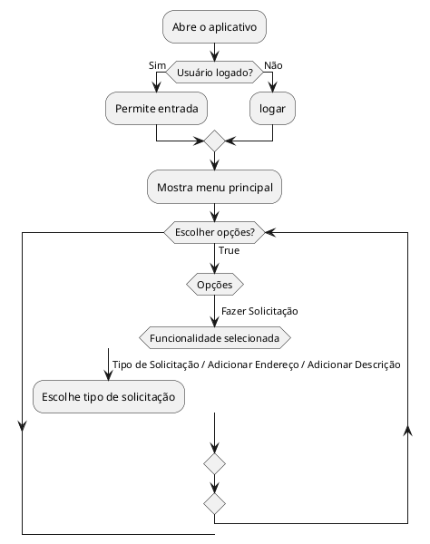

```plantuml
@startuml

:Abre o aplicativo;

if (Usuário logado?) then (Sim)
    :Permite entrada;
else (Não)
    :logar;
endif
:Mostra menu principal;

while (Escolher opções?) is (True)

switch (Opções)
case ( Fazer Solicitação )
    switch (Funcionalidade selecionada)
    case (Tipo de Solicitação / Adicionar Endereço / Adicionar Descrição)
        :Escolhe tipo de solicitação;
    endswitch
endswitch


@enduml
```
