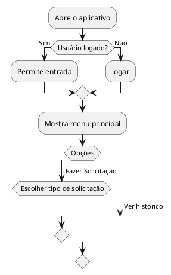

```plantuml
@startuml

:Abre o aplicativo;

if (Usuário logado?) then (Sim)
    :Permite entrada;
else (Não)
    :logar;
endif
:Mostra menu principal;

switch (Opções)
case ( Fazer Solicitação )
    switch( Escolher tipo de solicitação)
case ( Ver histórico )


    

@enduml
```
