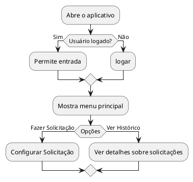

```plantuml
@startuml

:Abre o aplicativo;

if (Usuário logado?) then (Sim)
    :Permite entrada;
else (Não)
    :logar;
endif
:Mostra menu principal;

if (Opções) then (Fazer Solicitação)
    :Configurar Solicitação;
else (Ver Histórico)
    :Ver detalhes sobre solicitações;

@enduml
```
