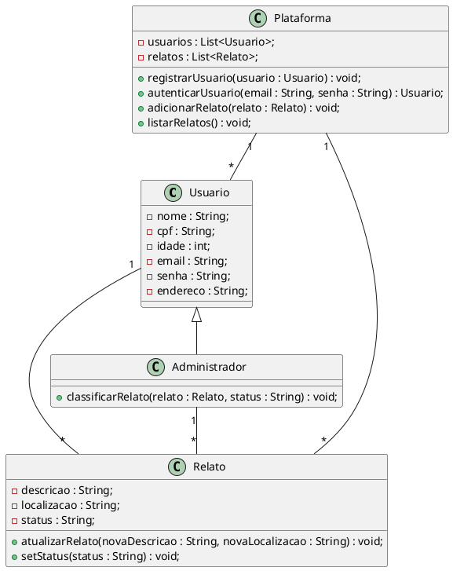

```plantuml
@startuml

class Usuario {
   - nome : String;
   - cpf : String;
   - idade : int;
   - email : String;
   - senha : String;
   - endereco : String;
}

class Relato {
   - descricao : String;
   - localizacao : String;
   - status : String;
   + atualizarRelato(novaDescricao : String, novaLocalizacao : String) : void;
   + setStatus(status : String) : void;
}

class Administrador {
   + classificarRelato(relato : Relato, status : String) : void;
}

class Plataforma {
   - usuarios : List<Usuario>;
   - relatos : List<Relato>;
   + registrarUsuario(usuario : Usuario) : void;
   + autenticarUsuario(email : String, senha : String) : Usuario;
   + adicionarRelato(relato : Relato) : void;
   + listarRelatos() : void;
}

Usuario <|-- Administrador
Usuario "1" -- "*" Relato
Administrador "1" -- "*" Relato
Plataforma "1" -- "*" Usuario
Plataforma "1" -- "*" Relato

@enduml
```