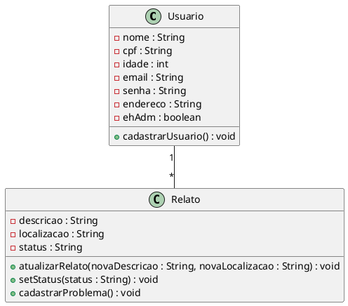

```plantuml
@startuml

class Usuario {
   - nome : String
   - cpf : String
   - idade : int
   - email : String
   - senha : String
   - endereco : String
   - ehAdm : boolean
   + cadastrarUsuario() : void
}

class Relato {
   - descricao : String
   - localizacao : String
   - status : String
   + atualizarRelato(novaDescricao : String, novaLocalizacao : String) : void
   + setStatus(status : String) : void
   + cadastrarProblema() : void
}

Usuario "1" -- "*" Relato

@enduml
```