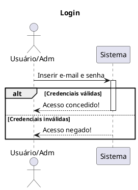
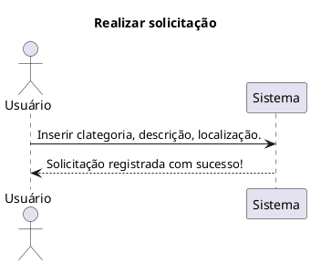
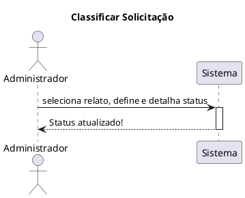
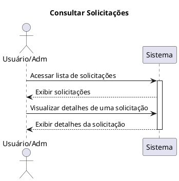

```plantuml
@startuml
title Login 

actor "Usuário/Adm" as usr
participant "Sistema" as sis

usr -> sis: Inserir e-mail e senha
activate sis

alt Credenciais válidas
    sis --> usr: Acesso concedido!
    deactivate sis
else Credenciais inválidas
    sis --> usr: Acesso negado!
end


@enduml
```

```plantuml
@startuml

title Realizar solicitação

actor "Usuário" as usr
participant "Sistema" as sis

usr -> sis: Inserir clategoria, descrição, localização.
sis --> usr: Solicitação registrada com sucesso!


@enduml
```

```plantuml
@startuml

title Classificar Solicitação

actor "Administrador" as admin
participant "Sistema" as sis

admin -> sis: seleciona relato, define e detalha status
activate sis

sis --> admin: Status atualizado!
deactivate sis

@enduml
```

```plantuml
@startuml

title Consultar Solicitações

actor "Usuário/Adm" as usr
participant "Sistema" as sis

usr -> sis: Acessar lista de solicitações
activate sis

sis --> usr: Exibir solicitações 

usr -> sis: Visualizar detalhes de uma solicitação

sis --> usr: Exibir detalhes da solicitação

deactivate sis

@enduml
```