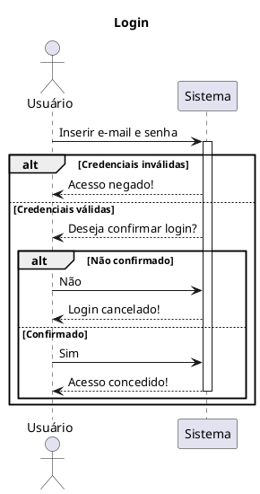

```plantuml
@startuml
title Login

actor "Usuário" as usr
participant "Sistema" as sis

usr -> sis: Inserir e-mail e senha
activate sis

alt Credenciais inválidas
    sis --> usr: Acesso negado!
else Credenciais válidas
    sis --> usr: Deseja confirmar login?
        alt Não confirmado
            usr -> sis: Não
            sis --> usr: Login cancelado!
        else Confirmado
            usr -> sis: Sim
            sis --> usr: Acesso concedido!
            deactivate sis
    end
end

@enduml
```