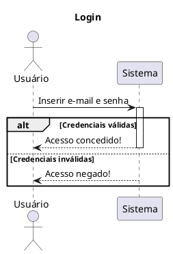
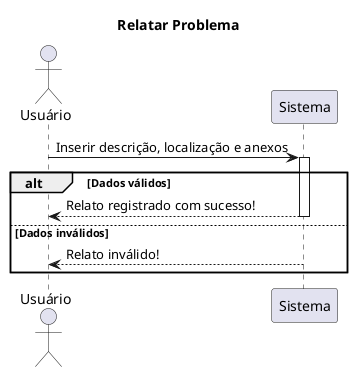

```plantuml
@startuml
title Login

actor "Usuário" as usr
participant "Sistema" as sis

usr -> sis: Inserir e-mail e senha
activate sis

alt Credenciais válidas
    sis --> usr: Acesso concedido!
    deactivate sis
else Credenciais inválidas
    sis --> usr: Acesso negado!
end


@enduml
```

```plantuml
@startuml

title Relatar Problema

actor "Usuário" as usr
participant "Sistema" as sis

usr -> sis: Inserir descrição, localização e anexos
activate sis

alt Dados válidos
    sis --> usr: Relato registrado com sucesso!
    deactivate sis
else Dados inválidos
    sis --> usr: Relato inválido!
end

@enduml
```