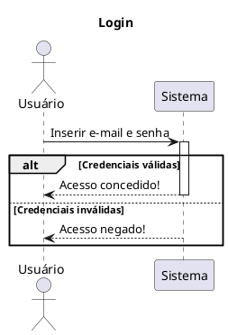

```plantuml
@startuml
title Login

actor "Usuário" as usr
participant "Sistema" as sis

usr -> sis: Inserir e-mail e senha
activate sis

alt Credenciais válidas
    sis --> usr: Acesso concedido!
    deactivate sis
else Credenciais inválidas
    sis --> usr: Acesso negado!
end


@enduml
```