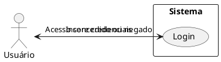

```plantuml
@startuml

actor "Usuário" as Usuario

rectangle "Sistema" {
    usecase "Login" as UC_Login
}

Usuario -> UC_Login: Insere credenciais
UC_Login -> Usuario: Acesso concedido ou negado

@enduml
```
