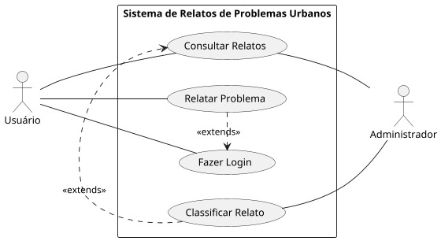

|2 Caso de Uso      | Relatar Problema |
| ------------- | ------------- |
| Ator principal |Usuário|
| Resumo | O usuário relata um problema urbano na plataforma. |
|Pré-condições | O usuário deve estar autenticado.|
|Pós-condições | Relato registrado com sucesso. |

### Fluxo principal

| Usuário    | Sistema      |
| ------------- | ------------- |
| 1. Insere a descrição, localização e anexos do problema. |   |
|  | 2. Valida as informações e registra o relato. |
|3. Confirma o envio do relato.| |
|| 4. Exibe mensagem de enviado.|

### Fluxo alternativo CA 1 - Usuário não autenticado

| Secretária      | Sistema      |
| ------------- | ------------- |
| | 2. Usuário não autenticado. Executar UC006 Autenticação de Usuário e retornar ao passo 2..|

