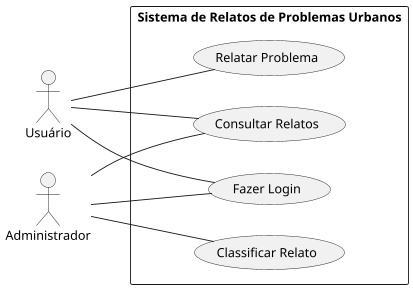

### 1o Caso de uso
| Caso de Uso      | Login no Sistema |
| ------------- | ------------- |
| Ator principal | Usuário |
| Resumo | O usuário acessa a plataforma inserindo suas credenciais para autenticação. |
| Pré-condições | O usuário deve possuir um cadastro prévio no sistema. |
| Pós-condições | O usuário é autenticado e pode acessar as funcionalidades do sistema. |

### Fluxo principal

| Usuário    | Sistema      |
| ------------- | ------------- |
| 1. Insere o e-mail e a senha. |   |
|  | 2. Valida as credenciais do usuário. |
| 3. Confirma a tentativa de login. | |
|  | 4. Concede acesso e redireciona para a página inicial. |

### Fluxo alternativo CA 1 - Credenciais inválidas

| Usuário      | Sistema      |
| ------------- | ------------- |
| 1. Insere o e-mail e a senha incorretos. |   |
|  | 2. Exibe mensagem de erro informando credenciais inválidas. |

### Fluxo alternativo CA 2 - Usuário não cadastrado

| Usuário      | Sistema      |
| ------------- | ------------- |
| 1. Insere e-mail que não está registrado. |   |
|  | 2. Exibe mensagem informando que o usuário não está cadastrado e sugere criação de conta. |

### 2o Caso de Uso 

|2 Caso de Uso      | Relatar Problema |
| ------------- | ------------- |
| Ator principal |Usuário|
| Resumo | O usuário relata um problema urbano na plataforma. |
|Pré-condições | O usuário deve estar autenticado.|
|Pós-condições | Relato registrado com sucesso. |

### Fluxo principal

| Usuário    | Sistema      |
| ------------- | ------------- |
| 1. Insere a descrição, localização e anexos do problema. |   |
|  | 2. Valida as informações e registra o relato. |
|3. Confirma o envio do relato.| |
|| 4. Exibe mensagem de enviado.|

### Fluxo alternativo CA 1 - Usuário não autenticado

| Usuário     | Sistema      |
| ------------- | ------------- |
| | 2. Usuário não autenticado. Solicitar criação do novo usuário|

### 3o Caso de Uso

| Caso de Uso      | Classificar Solicitação |
| ------------- | ------------- |
| Ator principal | Administrador |
| Resumo | O administrador classifica uma solicitação de relato, alterando seu status. |
| Pré-condições | O administrador deve estar autenticado no sistema. |
| Pós-condições | O status do relato é atualizado com sucesso. |

### Fluxo principal

| Administrador    | Sistema      |
| ------------- | ------------- |
| 1. Acessa a lista de relatos pendentes. |   |
| 2. Seleciona um relato para classificar. |   |
| 3. Escolhe um status para o relato. |   |
|  | 4. Atualiza o status do relato no sistema. |
| 5. Confirma a classificação. |   |
|  | 6. Exibe mensagem de sucesso. |

### 4o Caso de Uso
| Caso de Uso      | Consultar Solicitações |
| ------------- | ------------- |
| Ator principal | Usuário / Administrador |
| Resumo | O usuário ou administrador acessa a lista de solicitações registradas na plataforma. |
| Pré-condições | O usuário deve estar autenticado no sistema. |
| Pós-condições | A lista de solicitações é exibida com sucesso. |

### Fluxo principal

| Usuário / Administrador    | Sistema      |
| ------------- | ------------- |
| 1. Acessa a opção de consultar solicitações. |   |
|  | 2. Recupera a lista de solicitações registradas. |
|  | 3. Exibe a lista de solicitações com detalhes (descrição, localização, status, etc.). |

### Fluxo alternativo CA 1 - Nenhuma solicitação encontrada

| Usuário / Administrador      | Sistema      |
| ------------- | ------------- |
| 1. Acessa a opção de consultar solicitações. |   |
|  | 2. Não há registros de solicitações. |
|  | 3. Exibe mensagem informando que não há solicitações registradas. |
