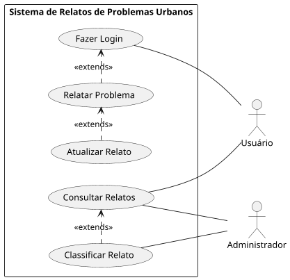

```plantuml
@startuml

scale 0.9
left to right direction

rectangle "Sistema de Relatos de Problemas Urbanos"{

usecase "Fazer Login" as UC001
usecase "Relatar Problema" as UC002
usecase "Atualizar Relato" as UC003
usecase "Classificar Relato" as UC004
usecase "Consultar Relatos" as UC005
}

actor "Usuário" as a001
actor "Administrador" as a002

UC002 .> UC001: <<extends>>
UC003 .> UC002: <<extends>>
a001 -- UC001

UC004 .> UC005: <<extends>>
a002 -- UC004

UC005 -- a001
UC005 -- a002

@enduml
```