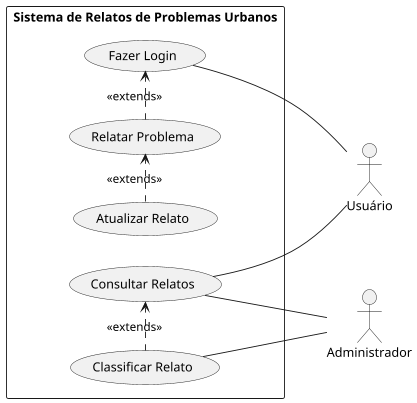

Especificação de caso de uso UC001 - Registrar Problema

Cod. Nome do caso de Uso

UC001 - Registrar Problema

Ator principal

Usuário

Resumo

O usuário relata um problema urbano na plataforma.

Pré-condições

O usuário deve estar autenticado.

Pós-condições

Relato registrado com sucesso.

Fluxo principal

Usuário

Sistema

1. Insere a descrição, localização e anexos do problema.

2. Valida as informações e registra o relato.

3. Confirma o envio do relato.

4. Exibe mensagem de sucesso.

Fluxo alternativo CA 1 - Usuário não autenticado

Usuário

Sistema

2. Usuário não autenticado. Executar UC006 Autenticação de Usuário e retornar ao passo 2.

Especificação de caso de uso UC002 - Atualizar Relato

Cod. Nome do caso de Uso

UC002 - Atualizar Relato

Ator principal

Usuário

Resumo

O usuário pode editar um relato previamente registrado.

Pré-condições

O relato já deve estar registrado.

Pós-condições

Relato atualizado com sucesso.

Fluxo principal

Usuário

Sistema

1. Seleciona um relato para edição.

2. Altera as informações desejadas.

3. Valida os dados e salva as alterações.

3. Confirma a atualização.

4. Exibe mensagem de sucesso.

Especificação de caso de uso UC003 - Classificar Relato

Cod. Nome do caso de Uso

UC003 - Classificar Relato

Ator principal

Administrador

Resumo

O administrador classifica o relato em uma das categorias disponíveis.

Pré-condições

O relato já deve estar registrado.

Pós-condições

Status do relato atualizado.

Fluxo principal

Administrador

Sistema

1. Acessa a lista de relatos pendentes.

2. Seleciona um relato para classificação.

3. Escolhe um status: "Negado", "Em avaliação", "Aprovado" ou "Finalizado".

4. Atualiza o status do relato e notifica o usuário.

Especificação de caso de uso UC004 - Consultar Histórico

Cod. Nome do caso de Uso

UC004 - Consultar Histórico

Ator principal

Usuário, Administrador

Resumo

Permite visualizar os relatos cadastrados.

Pré-condições

Deve haver relatos registrados.

Pós-condições

Relatos exibidos com sucesso.

Fluxo principal

Ator

Sistema

1. Acessa a lista de relatos.

2. Aplica filtros opcionais.

3. Exibe os relatos conforme os filtros aplicados.

Especificação de caso de uso UC005 - Notificar Usuário

Cod. Nome do caso de Uso

UC005 - Notificar Usuário

Ator principal

Sistema

Resumo

O sistema envia uma notificação ao usuário sempre que seu relato for atualizado.

Pré-condições

O relato deve ter sido atualizado pelo administrador.

Pós-condições

Notificação enviada com sucesso.

Fluxo principal

Sistema

1. Detecta alteração no status do relato.

2. Envia notificação ao usuário.

Especificação de caso de uso UC006 - Autenticação de Usuário

Cod. Nome do caso de Uso

UC006 - Autenticação de Usuário

Ator principal

Usuário

Resumo

O usuário acessa a plataforma com suas credenciais.

Pré-condições

O usuário deve ter uma conta cadastrada.

Pós-condições

Acesso concedido ou negado.

Fluxo principal

Usuário

Sistema

1. Insere e-mail e senha.

2. Valida credenciais.

3. Concede ou nega acesso.